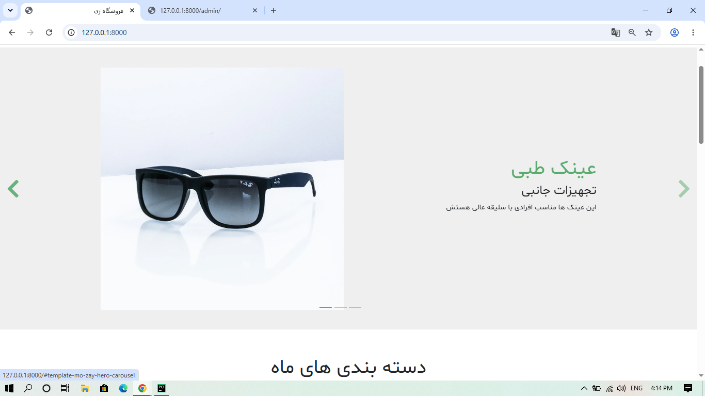
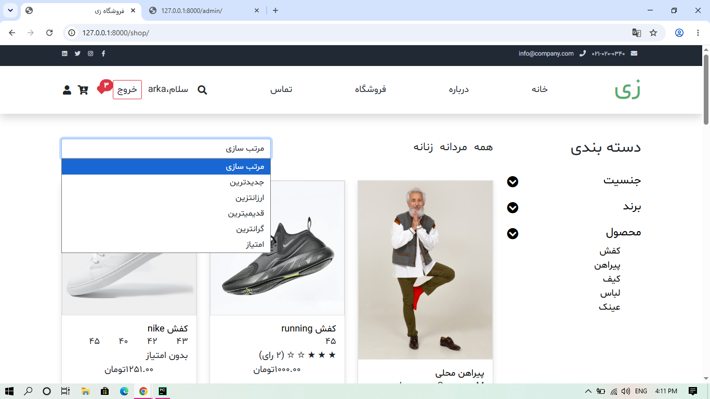
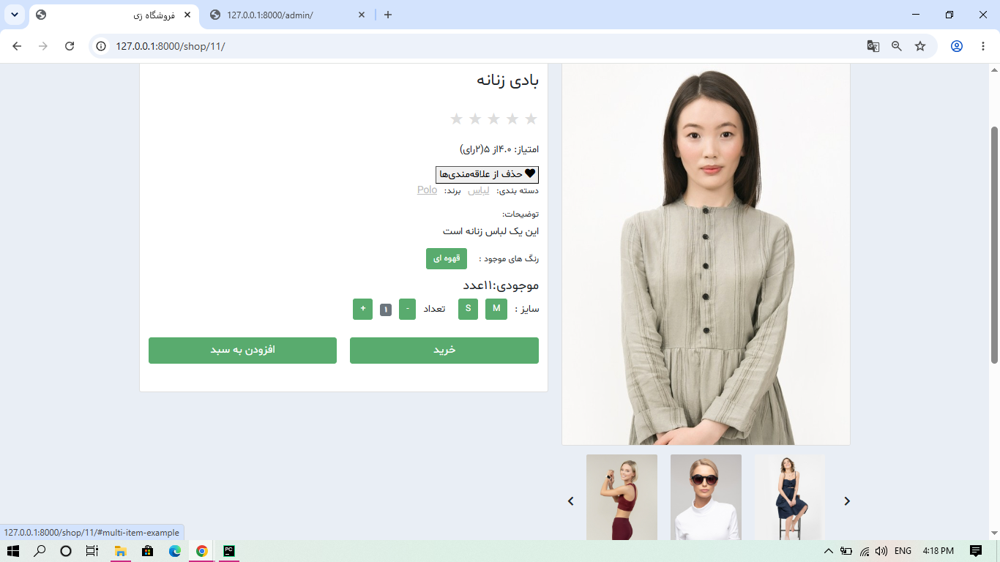
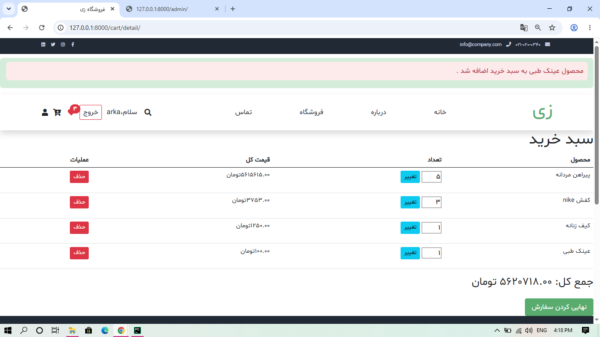
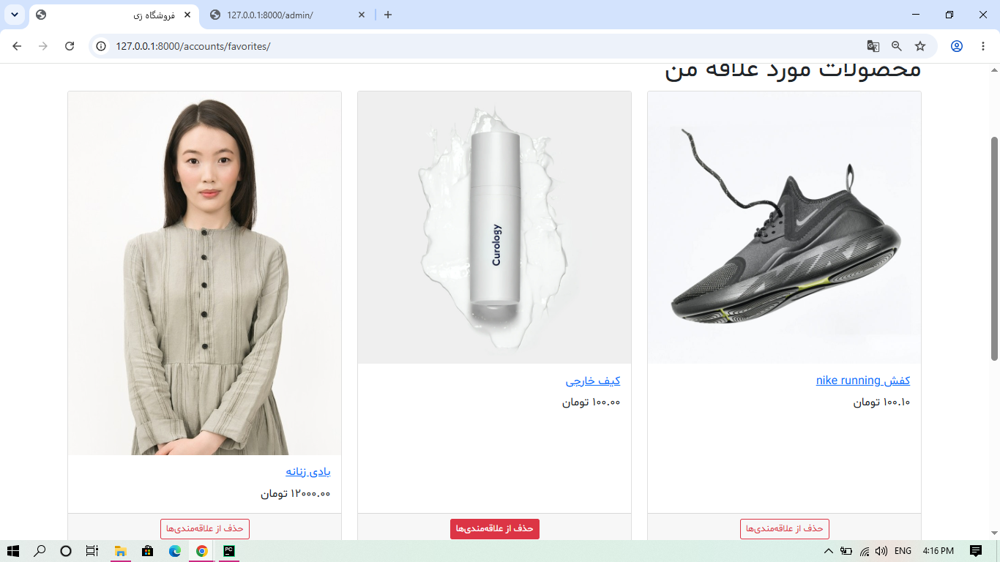
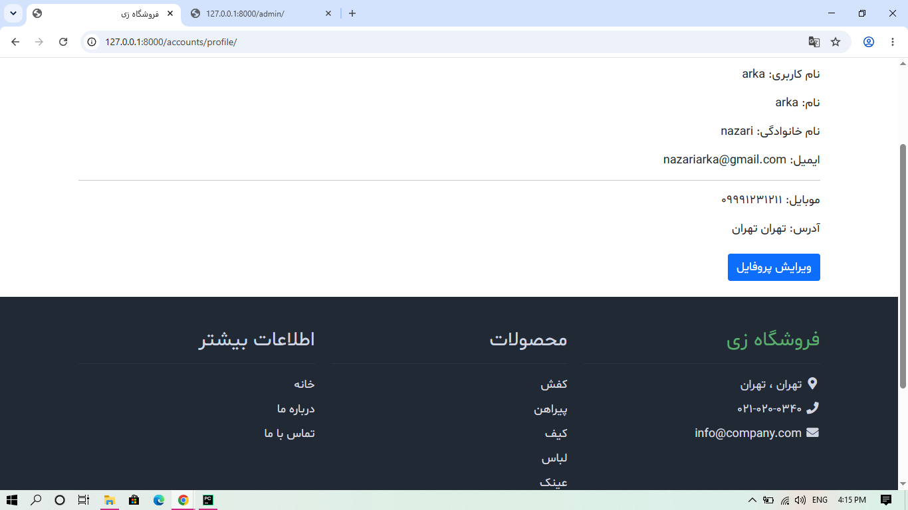

# Persian Clothing Store


A backend focused e-commerce application built with **Django** and **Django REST Framework**, developed as a portfolio project to demonstrate production-style backend architecture.

The project started as a traditional Django application (server-rendered templates) and was extended into a fully-featured RESTful API, backed by **PostgreSQL**, **Redis**, **Celery**, **Docker**, and an automated test suite with **Pytest**.


---

## Table of Contents

- [Features](#features)
- [Tech Stack](#tech-stack)
- [Main Database Models](#main-database-models)
- [API Endpoints](#main-api-endpoints)
- [Filtering, Search & Ordering](#filtering-search--ordering)
- [Testing](#testing)
- [Screenshots](#screenshots)
- [What I Learned](#what-i-learned)
- [Future Improvements](#future-improvements)
- [Author](#author)

---

## Features

### Web Application (Django Templates)
- User registration, login and logout
- User profile management
- Product catalog & detail pages
- Shopping cart & wishlist
- Product rating system
- Contact form
- Featured banners
- Product search
- Responsive Bootstrap interface

### REST API (Django REST Framework)

**Authentication**
- Registration, JWT login (access + refresh tokens)
- Token refresh, logout via refresh-token blacklist
- Change password, profile retrieve/update

**Products**
- List, detail, search, advanced filtering, ordering, pagination

**Ratings**
- List/create ratings, update own rating, rating summary (average + count)

**Wishlist**
- View, add, remove products

**Shopping Cart**
- View, add, update quantity, remove item, clear cart
- Automatic total calculation & stock validation

**Orders**
- Create order from cart, order history & details
- Snapshot of purchased prices, automatic stock update

**Performance**
- Redis caching with cache invalidation
- Query optimization (`select_related`, `prefetch_related`, `annotate`)

**Background Tasks**
- Celery + Redis broker for asynchronous email sending

**Other**
- Categories API, Banner API, Contact Message API
- OpenAPI schema, Swagger UI, ReDoc

---

## Tech Stack

| Category | Technologies |
|---|---|
| Language | Python |
| Framework | Django, Django REST Framework |
| Auth | Simple JWT |
| Database | PostgreSQL |
| Caching / Broker | Redis |
| Async Tasks | Celery |
| Containerization | Docker, Docker Compose |
| Filtering | django-filter |
| Testing | Pytest, pytest-django |
| Docs | drf-spectacular, Swagger UI, ReDoc |
| Frontend (templates) | HTML, CSS, Bootstrap |
| Other | Pillow, Git, GitHub |

---

## Main Database Models

`User` · `Profile` · `Product` · `Category` · `Brand` · `Rating` · `Cart` · `CartItem` · `Order` · `OrderItem` · `Banner` · `ContactMessage`

---

## Main API Endpoints

### Authentication
```http
POST   /api/auth/register/
POST   /api/token/
POST   /api/token/refresh/
POST   /api/auth/logout/
GET    /api/auth/profile/
PATCH  /api/auth/profile/
POST   /api/auth/change-password/
```

### Products
```http
GET    /api/products/
GET    /api/products/<slug>/
```

### Ratings
```http
GET    /api/products/<slug>/ratings/
POST   /api/products/<slug>/ratings/
GET    /api/products/<slug>/ratings/my-rating/
PATCH  /api/products/<slug>/ratings/my-rating/
GET    /api/products/<slug>/ratings/summary/
```

### Wishlist
```http
GET     /api/wishlist/
POST    /api/wishlist/
DELETE  /api/wishlist/<product_id>/
```

### Cart
```http
GET     /api/cart/
POST    /api/cart/
PATCH   /api/cart/items/<item_id>/
DELETE  /api/cart/items/<item_id>/
DELETE  /api/cart/clear/
```

### Orders
```http
GET     /api/orders/
POST    /api/orders/
GET     /api/orders/<order_id>/
```

### API Documentation
```http
GET     /api/schema/
GET     /api/schema/swagger/
GET     /api/schema/redoc/
```

### Other
```http
GET     /api/categories/
GET     /api/home/
POST    /api/contact/
```

---

## Filtering, Search & Ordering

**Filter by:** category, brand, gender, availability, featured, discounted, min/max price
**Search by:** product name, slug, category, brand, description
**Order by:** price, created date, average rating, number of ratings, featured

---

## Testing

Automated API test suite using **Pytest** and **pytest-django**, covering authentication, products, filtering, cart, wishlist, and orders.

- 35 automated API tests
- All tests are currently passing
```bash
pytest
```

---


## Screenshots

| Home Page | Shop Page |
|---|---|
|  |  |

| Product Details | Cart |
|---|---|
|  |  |

| Favorites | Profile |
|---|---|
|  |  |

---

## What I Learned

- Django & Django REST Framework fundamentals and RESTful API design
- JWT authentication, permissions, and custom serializers
- Generic Views vs. APIView, filtering/searching/ordering, pagination
- Query optimization (`select_related`, `prefetch_related`, `annotate`)
- Business logic for cart, orders, and inventory validation
- PostgreSQL, Docker, Redis, and Celery for background tasks
- API testing with Pytest and API documentation with drf-spectacular

---

## Future Improvements

- [ ] Order cancellation
- [ ] Payment gateway integration
- [ ] Product reviews & comments
- [ ] Coupon & discount codes
- [ ] CI/CD pipeline
- [ ] Production deployment (Nginx + Gunicorn)

---

## Author

**Arka**
Mechanical Engineering graduate focused on Backend Development with Python and Django.

- GitHub: <https://github.com/rkanz/>
- Email: <nazariarka@gmail.com>

---

## Note

This project was developed as a portfolio project to demonstrate backend development using Django and Django REST Framework, focusing on RESTful API design, authentication, business logic, PostgreSQL, Docker, Redis, Celery, caching, and automated testing.
